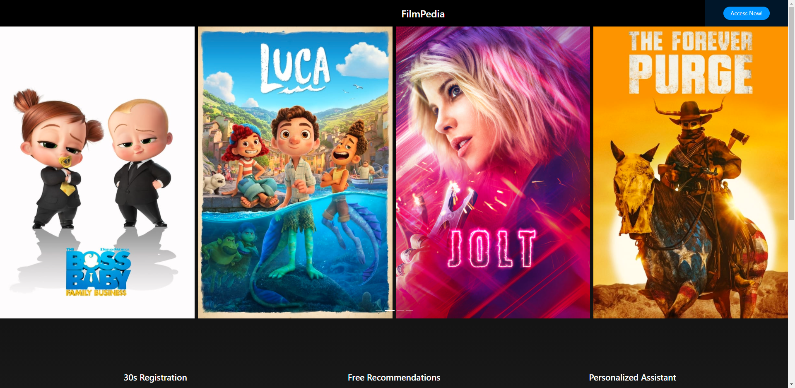
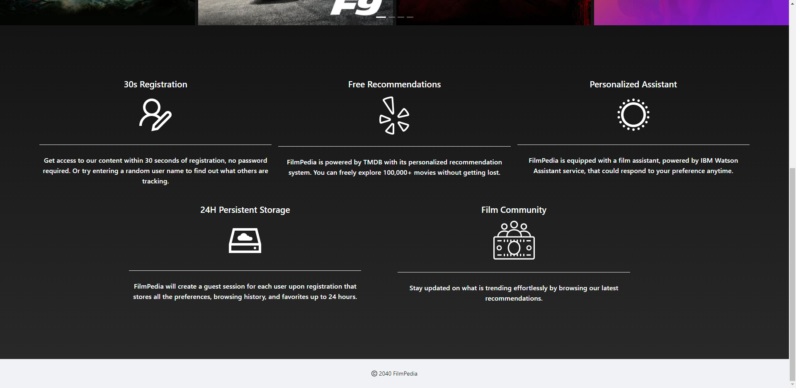
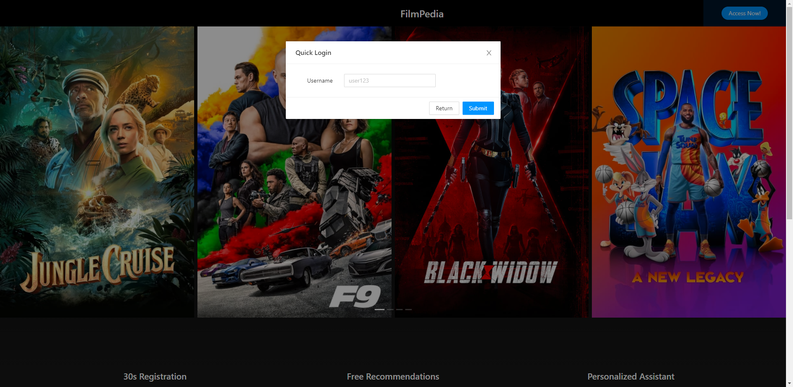
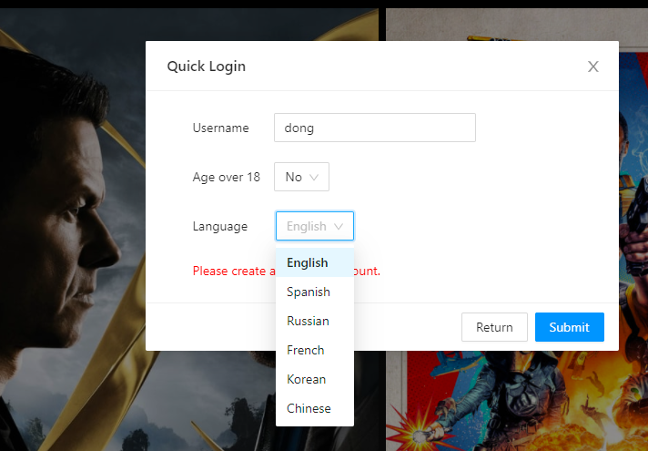
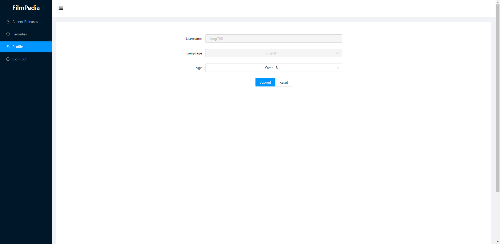

## Movie recommendation system: Filepedia

**Title:** Filepedia

**Project Name:** Chatbot based recommender system based on user profile and rating history

**Technology:** Django, React, TMDB(The movie database) and IBM Cloud 

**Description:**
  > The product is constituted by two modules: chatbot data collection and recommendation system. The chatbot module will ask information from the user by initiating a series of prepared questions in human natural language, and users will answer those questions based on the requirements of the recommendation system. The relevant questions might include: What actor do you like? What character do you like?  What is the release date the user wants to watch (e.g. 1950-1990?) After the data collection is over, the user will be given preliminary suggestions, a list of recommended movies. The users will then give feedback as to whether the suggestion is liked or not for further narrowing recommendation. 

**Web Page Demonstration:**

Home Page:



Login_page:
Our website provides user a quick login portal, which allows users to experience the website and all movie resources within 3 clicks.
If the user has registered with us before (including profile information on the database), then the user can use our QuickLogin portal and access the internal page immediately (so 1 click); 


However, if it's your their time to use our website, then they will need to fill out some basic information, so we know how to provide the best service to the customer. Here are several information we will ask the customer, before they can login to the website.
- Username(str and int): only character and number is allow (for security reason)
- age (bool): if you under 18, then some adult movie won't show up in the internal pages.
- language: Currently, our website supports 6 different kind of language. After you decided the language, everything (including chatbot) will be changed accordingly.
  



Internal Page:
Here is a the main page, customer will be seeing after login to the website. 

Default Version(English):
.png)

Chinese Version:
.jpg)

Profile Page: After login, users are allowed to change some basic profile information, except for their username and language.



  - Reference
    - IBM Personality prediction API: https://cloud.ibm.com/docs/personality-insights?topic=personality-insights-about
    - Jupyter Notebook, Deep Learning for Movie Recommendation, https://nbviewer.jupyter.org/github/khanhnamle1994/movielens/blob/master/Deep_Learning_Model.ipynb
    - Kaggle, Movies Recommender System, https://www.kaggle.com/rounakbanik/movie-recommender-systems
  - Things to consider:
    - Lnaguage? 18? Release date? Favoriate categories/Genres? Disliked genres?
  
 
## django_backend Overview
API
+ GetMovie
+ GetQuestion
+ PostAnswer

### TODO
#### timebox 2
+ [x] Basic API
+ [ ] Movie Model
+ [ ] User Model
+ [ ] Implement Session

## Q&A
- How to syn the package with requirements.txt:
  ```
  pip install -r requirements.txts
  ```
- How to run the server
  ```
  $py manage.py migrate (opt, to update the database)
  $py .\chatbot\manage.py runserver
  ```
- How to activate the venv environment?
  ```
  $ .\venv\Scripts\activate
  ```

