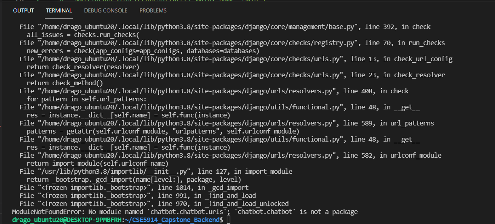
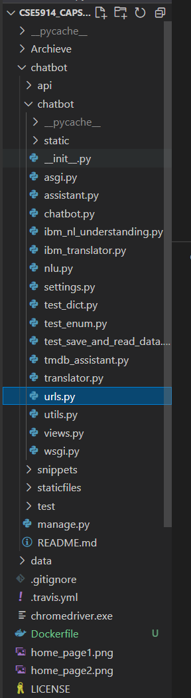
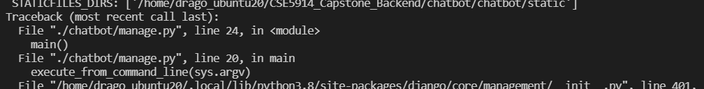
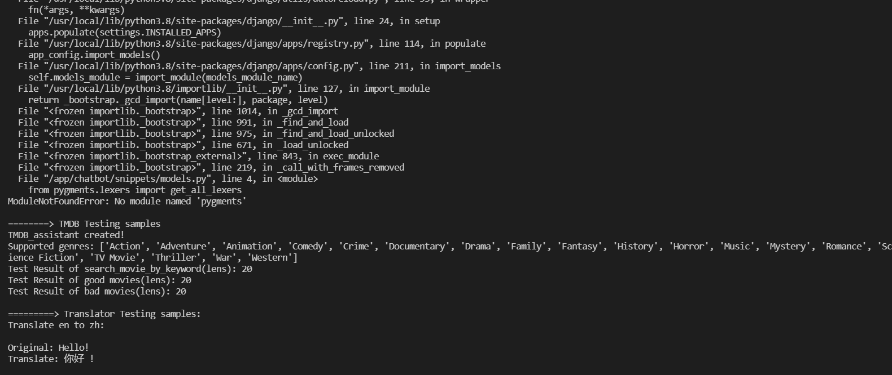
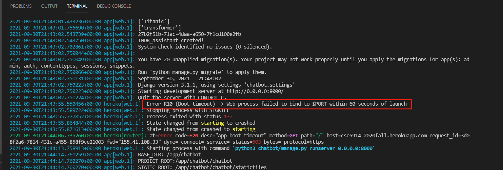
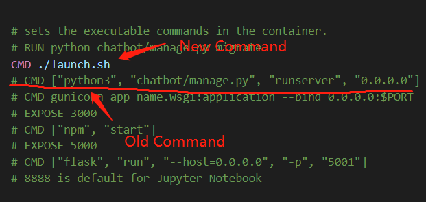
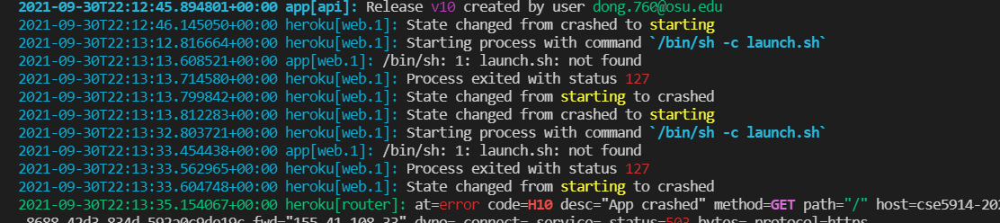

## Movie recommendation system: Filepedia

**Title:** Filepedia

**Project Name:** Chatbot based recommender system based on user profile and rating history

**Technology:** Django, React, Travis CI, TMDB(The movie database) and IBM Cloud 

**Description:**
  > The product is constituted by two modules: chatbot data collection and recommendation system. The chatbot module will ask information from the user by initiating a series of prepared questions in human natural language, and users will answer those questions based on the requirements of the recommendation system. The relevant questions might include: What actor do you like? What character do you like?  What is the release date the user wants to watch (e.g. 1950-1990?) After the data collection is over, the user will be given preliminary suggestions, a list of recommended movies. The users will then give feedback as to whether the suggestion is liked or not for further narrowing recommendation. 

**Web Page Demonstration:**

Home Page:


Login_page:
Our website provides user a quick login portal, which allows users to experience the website and all movie resources within 3 clicks.
If the user has registered with us before (including profile information on the database), then the user can use our QuickLogin portal and access the internal page immediately (so 1 click); 


However, if it's your their time to use our website, then they will need to fill out some basic information, so we know how to provide the best service to the customer. Here are several information we will ask the customer, before they can login to the website.
- Username(str and int): only character and number is allow (for security reason)
- age (bool): if you under 18, then some adult movie won't show up in the internal pages.
- language: Currently, our website supports 6 different kind of language. After you decided the language, everything (including chatbot) will be changed accordingly.
  


Internal Page:
Here is a the main page, customer will be seeing after login to the website. 

Default Version(English):
.png)

Chinese Version:
.jpg)

Profile Page: After login, users are allowed to change some basic profile information, except for their username and language.


Here is a demo video that demonstrated most of the features that we created for the website, https://youtu.be/4NUrV0MpXek


  - Reference
    - IBM Personality prediction API: https://cloud.ibm.com/docs/personality-insights?topic=personality-insights-about
    - Jupyter Notebook, Deep Learning for Movie Recommendation, https://nbviewer.jupyter.org/github/khanhnamle1994/movielens/blob/master/Deep_Learning_Model.ipynb
    - Kaggle, Movies Recommender System, https://www.kaggle.com/rounakbanik/movie-recommender-systems
  - Things to consider:
    - Lnaguage? 18? Release date? Favoriate categories/Genres? Disliked genres?


## django_backend Overview
API
+ GetMovie
+ GetQuestion
+ PostAnswer

### TODO
#### timebox 2
+ [x] Basic API
+ [ ] Movie Model
+ [ ] User Model
+ [ ] Implement Session

## Q&A
- How to syn the package with requirements.txt:
  ```
  pip install -r requirements.txts
  ```
- How to run the server
  ```
  $py manage.py migrate (opt, to update the database)
  $py .\chatbot\manage.py runserver
  ```
- How to activate the venv environment?
  ```
  $ .\venv\Scripts\activate
  ```

- How to update to Heroku
```
git add .
git commit -m 'Update'
git push
git push heroku timebox5.1:master
```


## Debugging Note of Deployments
Bug1

- Problem Definitions









As you can see the problem here is not very clear. The error message pop up “ModuleNotFound Error”, and it’s points out its something related to `execute_from_command_line(sys.argv)` in ./chatbot/manage.py file.

==> But, in fact, this is something related to the 

- Solution:

This project is originally running under Windows 10 environment with VS editor. For deployment purpose, I need to troubleshoot it under Linux environment (with WSL 2 ubuntu 20 in this case). ==> So, after `pip install -r requirements.txt`, there always will have some problem about incompatible packages that cannot be found or installed. ==> So, the common things that I do is to remove all problematic packages, and then manully install all missing package based on the Error message. 

==> In this case, it’s actually not something related to dependency, but related to the Dockerfile, the way that I solve this is: Reading a lot of tutorial, and documentation, and try it yourself, test it, run it, and experiment it 


==> LOL, haha of cause, I will give your the secrete receipt; Or nobody will every ready my blog right?

So, here is the trick. First, if your docker file is using something like,`FROM python:3.8.5-alpine` ==> Then change it to more generic verion, something like `FROM python:3.8.5` or  just `FROM python:3` ==> and then try again!

That’s the what, now, you want to know the Why, are you? ==> OMG< people are so greedy!

==> I got you. It’s written on the [Docker Hubs](https://hub.docker.com/_/python)(Yes, not Dockerfile, i won’t blame you if you dont know). Here is what you need to know

>  python:<version>-slim ==> This image does not contain the common packages contained in the default tag and only contains the minimal packages needed to run python. 

> python:<version>-alpine ==> This image is based on the popular Alpine Linux project, available in the alpine official image. Alpine Linux is much smaller than most distribution base images (~5MB), and thus leads to much slimmer images in general.


Second, if that’s not working, try to remove all those dependency that you don’t know or don’t think they should be there, and them test it in your local machine. Install all missing package, until it running at your local machine, before building any image with Docker.


2. Bug2: 



==> I think I just remove it from requirements.txt package! ==> As I said, there so redundant packages that you don’t actually need it for the app!


3. Bug2:

**Problem Definition:**

Note: this is what happen at running “heroku logs –tails” ==> Yes we have docker image being built successfully, and being able to run it at local machine



**Solution:**

This is the problem with your docker file, unlike you are running at your local container. You don’t have to specify any PORT number, instead, Heroku will provide a PORT number for you;

Here is the command you should use for Dockerfile: 



==> So, instead of providing the command at Dockerfile, you should created a new bash file, and putting all the command into that bash script, such as setting up environment variable, database migration, etc. Here, is an example what I used for my launch.sh

```bash
#!/bin/bash
# PORT=8000
python3 chatbot/manage.py runserver 0.0.0.0:$PORT
# export FLASK_APP=project.server
# export APP_SETTINGS="project.server.config.DevelopmentConfig"
# flask db init
# python chatbot/manage.py migrate
# flask db upgrade
#flask run --host=0.0.0.0 --port=5000
# flask run
```

==> Yes, you don’t need to provide or define the PORT variable, Heroku will created for you!!! (I know it’s confused to put it here, but it will remind you somehow)


4. Bug4



==> This one is simple, but tricky

Old vs New command:

```dockerfile
# Old command ==> I thought we don't need that dot and backslash in Linux ==> But, obviously I am wrong!
CMD launch.sh
# New command
CMD ./launch.sh
```


## Final Running Log:

Here is what you see after being deployed to Heroku as container:

```bash
(CSE5914_Capstone_Backend) drago_ubuntu20@DESKTOP-9PMBFRH:/mnt/e/Zhengqi Dong/Education/BU/2021_Fall/CS501-spark project/Docker_Project/CSE5914_Capstone_Backend$ heroku container:push web
=== Building web (/mnt/e/Zhengqi Dong/Education/BU/2021_Fall/CS501-spark project/Docker_Project/CSE5914_Capstone_Backend/Dockerfile)
[+] Building 465.1s (18/18) FINISHED
 => [internal] load build definition from Dockerfile                                                                                                        0.1s 
 => => transferring dockerfile: 3.78kB                                                                                                                      0.1s 
 => [internal] load .dockerignore                                                                                                                           0.0s 
 => => transferring context: 2B                                                                                                                             0.0s 
 => resolve image config for docker.io/docker/dockerfile:1                                                                                                 11.4s 
 => [auth] docker/dockerfile:pull token for registry-1.docker.io                                                                                            0.0s 
 => CACHED docker-image://docker.io/docker/dockerfile:1@sha256:9e2c9eca7367393aecc68795c671f93466818395a2693498debe831fd67f5e89                             0.0s 
 => [internal] load .dockerignore                                                                                                                           0.0s 
 => [internal] load build definition from Dockerfile                                                                                                        0.0s 
 => [internal] load metadata for docker.io/library/python:3.8                                                                                               2.0s 
 => [auth] library/python:pull token for registry-1.docker.io                                                                                               0.0s 
 => [internal] load build context                                                                                                                         440.2s 
 => => transferring context: 4.02MB                                                                                                                       440.1s 
 => [1/7] FROM docker.io/library/python:3.8@sha256:0f594721ed51e1cccd5881f979a7b42ee7109d22749d246fc41d0e3ef4a52ba1                                         0.0s 
 => CACHED [2/7] WORKDIR /app                                                                                                                               0.0s
 => CACHED [3/7] RUN apt-get update && apt-get install -y --no-install-recommends         python3-setuptools         python3-pip         python3-dev        0.0s 
 => CACHED [4/7] COPY requirements.txt requirements.txt                                                                                                     0.0s 
 => CACHED [5/7] RUN pip3 install --upgrade pip                                                                                                             0.0s 
 => CACHED [6/7] RUN pip3 install -r requirements.txt                                                                                                       0.0s 
 => [7/7] COPY . .                                                                                                                                          6.2s 
 => exporting to image                                                                                                                                      4.7s 
 => => exporting layers                                                                                                                                     4.7s 
 => => writing image sha256:694536ae336d6a4715f022ee7aaafaf70688ea29cb9b1b4361e4cdefd5ae71c2                                                                0.0s 
 => => naming to registry.heroku.com/cse5914-2020fall/web                                                                                                   0.0s 

Use 'docker scan' to run Snyk tests against images to find vulnerabilities and learn how to fix them
=== Pushing web (/mnt/e/Zhengqi Dong/Education/BU/2021_Fall/CS501-spark project/Docker_Project/CSE5914_Capstone_Backend/Dockerfile)
Using default tag: latest
The push refers to repository [registry.heroku.com/cse5914-2020fall/web]
d9f118c3b42e: Pushed
557312f49261: Layer already exists
1b65527d57e4: Layer already exists
40117eb0470b: Layer already exists
52d67d075016: Layer already exists
9522f4f9dbb9: Layer already exists
b205930be12f: Layer already exists
f38f5a1e3486: Layer already exists
2cc26e7045c8: Layer already exists
c1792902851c: Layer already exists
c272c95c3fb0: Layer already exists
3054497613e6: Layer already exists
d35dc7f4c79e: Layer already exists
dabfe5b2ea81: Layer already exists
5e6a409f30b6: Layer already exists
latest: digest: sha256:ee4b58742b9a4d614e6e6831a42434a4754905c22a48bddc801f87e3274877c5 size: 3478
Your image has been successfully pushed. You can now release it with the 'container:release' command.
(CSE5914_Capstone_Backend) drago_ubuntu20@DESKTOP-9PMBFRH:/mnt/e/Zhengqi Dong/Education/BU/2021_Fall/CS501-spark project/Docker_Project/CSE5914_Capstone_Backend$ heroku container:release web
Releasing images web to cse5914-2020fall... done
```


Here is what you see with `heroku logs --tails`

```bash
2021-09-30T23:30:23.898411+00:00 app[api]: Deployed web (694536ae336d) by user dong.760@osu.edu
2021-09-30T23:30:23.898411+00:00 app[api]: Release v11 created by user dong.760@osu.edu
2021-09-30T23:30:29.812163+00:00 heroku[web.1]: State changed from crashed to starting
2021-09-30T23:30:50.726864+00:00 heroku[web.1]: Starting process with command `/bin/sh -c ./launch.sh`
2021-09-30T23:30:52.429466+00:00 app[web.1]: BASE_DIR: /app/chatbot
2021-09-30T23:30:52.429475+00:00 app[web.1]: PROJECT_ROOT:/app/chatbot/chatbot
2021-09-30T23:30:52.429476+00:00 app[web.1]: STATIC_ROOT: /app/chatbot/chatbot/staticfiles    
2021-09-30T23:30:52.429476+00:00 app[web.1]: STATIC_ROOT:/app/chatbot/chatbot/staticfiles     
2021-09-30T23:30:52.429480+00:00 app[web.1]: STATICFILES_DIRS: ['/app/chatbot/chatbot/static']
2021-09-30T23:30:54.065248+00:00 app[web.1]: BASE_DIR: /app/chatbot
2021-09-30T23:30:54.065269+00:00 app[web.1]: PROJECT_ROOT:/app/chatbot/chatbot
2021-09-30T23:30:54.065269+00:00 app[web.1]: STATIC_ROOT: /app/chatbot/chatbot/staticfiles
2021-09-30T23:30:54.065269+00:00 app[web.1]: STATIC_ROOT:/app/chatbot/chatbot/staticfiles 
2021-09-30T23:30:54.065275+00:00 app[web.1]: STATICFILES_DIRS: ['/app/chatbot/chatbot/static']
2021-09-30T23:30:55.368118+00:00 app[web.1]: Watching for file changes with StatReloader
2021-09-30T23:30:55.375832+00:00 app[web.1]: Performing system checks...
2021-09-30T23:30:55.375833+00:00 app[web.1]: 
2021-09-30T23:30:55.610348+00:00 app[web.1]:
2021-09-30T23:30:55.610369+00:00 app[web.1]: ========> TMDB Testing samples
2021-09-30T23:30:55.610393+00:00 app[web.1]: TMDB_assistant created!
2021-09-30T23:30:55.678462+00:00 app[web.1]: Supported genres: ['Action', 'Adventure', 'Animation', 'Comedy', 'Crime', 'Documentary', 'Drama', 'Family', 'Fantasy', 'History', 'Horror', 'Music', 'Mystery', 'Romance', 'Science Fiction', 'TV Movie', 'Thriller', 'War', 'Western']
2021-09-30T23:30:55.888830+00:00 app[web.1]: Test Result of search_movie_by_keyword(lens): 20
2021-09-30T23:30:55.975549+00:00 app[web.1]: Test Result of good movies(lens): 20
2021-09-30T23:30:56.075821+00:00 app[web.1]: Test Result of bad movies(lens): 20
2021-09-30T23:30:56.076271+00:00 app[web.1]: 
2021-09-30T23:30:56.076294+00:00 app[web.1]: =========> Translator Testing samples:
2021-09-30T23:30:56.795434+00:00 app[web.1]: Translate en to zh:
2021-09-30T23:30:56.795445+00:00 app[web.1]:
2021-09-30T23:30:56.795445+00:00 app[web.1]: Original: Hello!
2021-09-30T23:30:56.795446+00:00 app[web.1]: Translate: 你好 !
2021-09-30T23:30:56.795446+00:00 app[web.1]:
2021-09-30T23:30:56.795447+00:00 app[web.1]: Original: What's going on?
2021-09-30T23:30:56.795447+00:00 app[web.1]: Translate: 发生什么事了
2021-09-30T23:30:56.795447+00:00 app[web.1]:
2021-09-30T23:30:56.803216+00:00 app[web.1]:
2021-09-30T23:30:56.803245+00:00 app[web.1]: =======> Example usage of NLU
2021-09-30T23:30:56.804297+00:00 app[web.1]: text2: I want to watch Star Trek moives
2021-09-30T23:30:57.970378+00:00 app[web.1]: Keyword: ['Star Trek moives']
2021-09-30T23:30:58.289872+00:00 app[web.1]: Sentiment scores: 0.608018
2021-09-30T23:30:58.587856+00:00 app[web.1]: Cast/Crews: []
2021-09-30T23:30:58.850658+00:00 app[web.1]: Target Movie: []
2021-09-30T23:30:58.850668+00:00 app[web.1]:
2021-09-30T23:30:59.743654+00:00 app[web.1]: ['Titanic']
2021-09-30T23:31:00.016734+00:00 app[web.1]: ['Titanic']
2021-09-30T23:31:00.311124+00:00 app[web.1]: ['transformer']
2021-09-30T23:31:01.021202+00:00 app[web.1]: 001cf849-76d8-43d3-b52c-514c1960e73c
2021-09-30T23:31:01.021219+00:00 app[web.1]: TMDB_assistant created!
2021-09-30T23:31:01.173254+00:00 app[web.1]: System check identified no issues (0 silenced).
2021-09-30T23:31:01.236134+00:00 app[web.1]:
2021-09-30T23:31:01.236142+00:00 app[web.1]: You have 20 unapplied migration(s). Your project may not work properly until you apply the migrations for app(s): admin, auth, contenttypes, sessions, snippets.
2021-09-30T23:31:01.236148+00:00 app[web.1]: Run 'python manage.py migrate' to apply them.
2021-09-30T23:31:01.236233+00:00 app[web.1]: September 30, 2021 - 23:31:01
2021-09-30T23:31:01.236234+00:00 app[web.1]: Django version 3.1.1, using settings 'chatbot.settings'
2021-09-30T23:31:01.236234+00:00 app[web.1]: Starting development server at http://0.0.0.0:24545/
2021-09-30T23:31:01.236234+00:00 app[web.1]: Quit the server with CONTROL-C.
2021-09-30T23:31:01.289067+00:00 heroku[web.1]: State changed from starting to up
2021-09-30T23:31:03.578187+00:00 app[web.1]: [30/Sep/2021 23:31:03] "GET / HTTP/1.1" 200 1202
2021-09-30T23:31:03.577281+00:00 heroku[router]: at=info method=GET path="/" host=cse5914-2020fall.herokuapp.com request_id=701b8e65-151f-477a-aaf2-18c9857406e6 fwd="24.2.200.166" dyno=web.1 connect=0ms service=14ms status=200 bytes=1459 protocol=https
2021-09-30T23:31:04.169842+00:00 heroku[router]: at=info method=GET path="/favicon.ico" host=cse5914-2020fall.herokuapp.com request_id=6c0c801b-f4fa-4bcf-91af-dfe7d763e83e fwd="24.2.200.166" dyno=web.1 connect=2ms service=32ms status=404 bytes=6678 protocol=https
2021-09-30T23:31:04.165772+00:00 app[web.1]: Not Found: /favicon.ico
2021-09-30T23:31:04.166266+00:00 app[web.1]: [30/Sep/2021 23:31:04] "GET /favicon.ico HTTP/1.1" 404 6429
2021-09-30T23:31:28.582648+00:00 heroku[router]: at=info method=GET path="/" host=cse5914-2020fall.herokuapp.com request_id=b77c13fa-1c86-4b92-a263-bf4eb4d2db30 fwd="24.2.200.166" dyno=web.1 connect=0ms service=3ms status=200 bytes=1459 protocol=https
2021-09-30T23:31:28.584172+00:00 app[web.1]: [30/Sep/2021 23:31:28] "GET / HTTP/1.1" 200 1202
2021-09-30T23:31:37.620636+00:00 heroku[router]: at=info method=GET path="/api/get_latest_movie/" host=cse5914-2020fall.herokuapp.com request_id=d8f820db-c4ab-4c21-8010-2468888a49f5 fwd="24.2.200.166" dyno=web.1 connect=0ms service=264ms status=200 bytes=1387 protocol=http
2021-09-30T23:31:37.621135+00:00 app[web.1]: [30/Sep/2021 23:31:37] "GET /api/get_latest_movie/ HTTP/1.1" 200 1101
2021-09-30T23:38:11.448804+00:00 heroku[router]: at=info method=GET path="/" host=cse5914-2020fall.herokuapp.com request_id=a75b3404-f733-4f66-8b98-218f4a5d849a fwd="24.2.200.166" dyno=web.1 connect=0ms service=2ms status=200 bytes=1459 protocol=https
2021-09-30T23:38:11.449910+00:00 app[web.1]: [30/Sep/2021 23:38:11] "GET / HTTP/1.1" 200 1202
```

